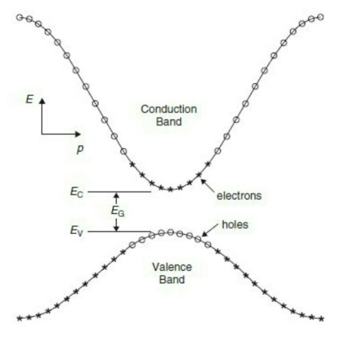
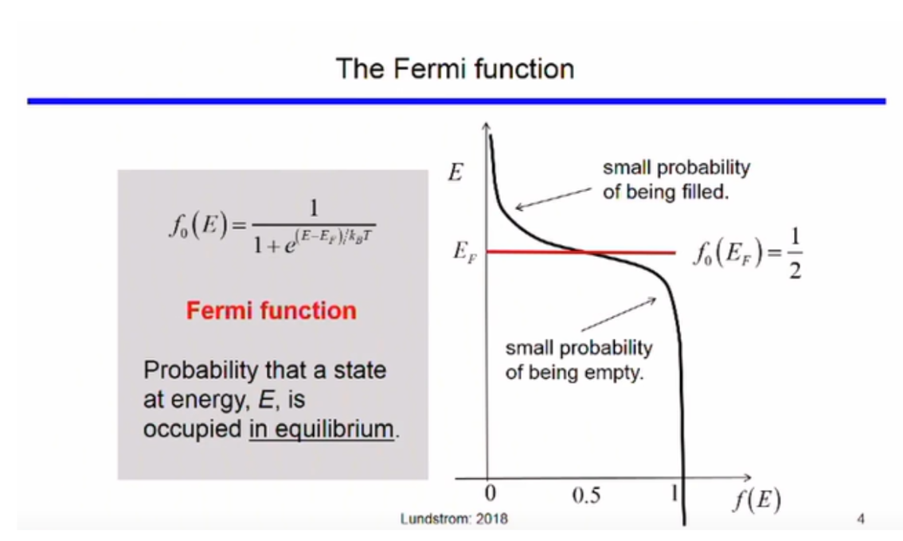

## The Quantum Free Electron Model
In 1928, Sommerfield proposed the quantum free electron theory. This theory comes from applying the principles of Quantum Mechanics to the electron. According to this theory, valence electrons can move freely in a metal and are prevented from escaping the metal at its high potential boundaries.

This idea can be applied to valence electrons in the semiconductor as well. The energy of the electron(E) is related to its momentum (k) by the following equation

$$
E = E_{o} + \frac{h^{2} k^{2}}{2m_{o}}
$$

## Electrons enclosed in Potential Energy boundaries
For a pure metal conductor, the ends of a metal act like a finite potential well(see <a href="https://virtual-labs.github.io/exp-swe-solutions-iiith/">link</a>). For a crystal lattice the potential barrier(dispersion of energy) is periodic. The solution of the schrodinger equation is of the form -
$$
\psi (x) = u_{k}(r) e^{ikr}
$$
Where $$u_{k}(r+a) = u_{k}(r) $$ 
is use dto represent the periodic potential barrier. This is also called the Bloch wave.

Because of the periodic nature dispersion of energy, only the energy between -&pi;/a and &pi;/a is analyzed as the function follows the same pattern for the rest of its values. Also note that just like in metals, quantum wells can be observed in semiconductors. The boundaries are, however, linear functions of x rather than a constant.

## Schrodinger Equation in a Periodic Lattice

The Schrodinger equation for a particle of mass m in the periodic potential V(r) may be written
$$
H \psi = {- \frac{\hbar ^{2} \nabla ^{2}}{2m} + V(r)} \psi = E\psi
$$

The periodic potential can be represented in fourier series as:

$$
V(r) = \Sigma _{G} V_{G} e^{iG \cdot r}
$$

where the "G" and "r" are the reciprocal lattice vectors.We are at liberty to set the origin of potential energy wherever we like as a convenience for later derivations we set the uniform background potential to be zero, i.e.

$$
V_{0} \equiv 0
$$
We can write the wave function ψ as a sum of plane waves obeying the Born–von Karman boundary conditions,

$$
\psi (r) = \Sigma _{k} C_{k} e^{ik \cdot r}
$$

We now substitute the wave function and the potential into Schrodinger equation to give - 

$$
\Sigma _{k} \frac {\hbar ^{2} k^{2}{2m}}{2m} C_{k}e^{iG \cdot r} + {\Sigma _{G} V_{G} e^{iG \cdot r}} {\Sigma _{k} C_{k} e^{ik \cdot r}} = E {\Sigma _{k} C_{k} e^{ik \cdot r}}
$$

The potential energy term can be rewritten as

$$
V(r)\psi = \Sigma _{G,k} V_{G} C_{k} e^{i(G+r).r}
$$

where the sum on the right-hand side is over all G and k. As the sum is overall possible values of G and k, it can be rewritten as

$$
V(r)\psi = \Sigma _{G,k} V_{G} C_{k-G} e^{ik.r}
$$

#### Bloch’s Theorem
For each distinct value of <b>q</b>, the wavefunction takes the form:

$$
\psi _{q}(r) = \Sigma _{G} C_{q-G} e^{-i(q-G).r}
$$

This can be rewritten as:

$$
\psi _{q}(r) = e^{iq.r} \Sigma _{G} C_{q-G} e^{-iG.r} = e^{iq.r}u_{j,q}
$$
On substituting the above equation in SWE and solving it (solution is done computationally due to it complexity), we obtain a solution which somewhat 
resembles decaying wave equation bounded by +-1 (i.e. cos \theta). The valid solution defines the locations (called states) where electrons can 
exist. Other locations are not the solution and hence, are forbidded for the electron
## Conduction Bands and Valence Bands
The energy vs momentum graphs of the conduction and valence bands are as follows

Part of the solution is shown in figure above also, called E-k diagram. Y axis is electron energy (E) and x axis the momentum (k). The two bands (most important ones in Semiconductors) show the states where electrons exist. The lower band has lower energy band called the valence band and the top band contains the higher energy electrons and is called the conduction band. The various possible locations (E,k) are the available states. Between the two band is the forbidden zone which we call as Energy Band Gap. Lower energy electrons will gain energy (via externally applied heat, light, electric field etc.) and jump to higher band leaving behind vacancies called holes. All empty states are shown as circles (holes) and occupied states and filled holes.Highest energy level Valence Band is called Valance Band Energy Ev ad lowest energy level in conduction band is called the conduction band energy Ec.Difference between them is Band gap Eg. For Silicon this is 1.12 eV and 
Germanium it is 0.67 eV 

E-k diagram also gives in formation about the velocity (group velocity to be more specific) and mass of the particles. The slope of E
k diagram (dE/dk) gives the hbar*vg. The second derivative (curvature) of the E-k diagram is inversely proportional to mass 
(effective mass more specifically) 

$$
m* = \frac {\hbar ^{2}}{\frac {d^{2}E} {dk^{2}} }
$$

## Density of States
The density of states (DOS) of a system describes the number of allowed modes or states per unit energy range. These states are uniformly distributed across the momentum(k). Their distribution across energy, however, depends on the energy momentum function.

We know, energy as a function of momentum is

$$
E(k) = E_{k} + \frac {h^{2}k^{2}}{2m_{o}}
$$

We are considering the parabolic function because the electrons are concentrated in that minima and the maxima region. In a 1 dimensional structure, we can write a function D(E) such that it is equal to the number of particles in the “k” space per unit length.

## Fermi Level
The fermi function gives the probability of a state(if it exists) being occupied at equilibrium.

$$
f_{o}(E) = \frac {1}{1+e^{E+E_{f}/k_{B}T}}
$$

The parameters of the function are, Ef and T.

It also describes the electron density in the conduction band and the hole density in the valence band.

$$
f_{o}(E) = \frac{1}{2}
$$

The fermi level is the value of Ef when the fermi function equates to ½, i.e.

States below the fermi level have a low probability of being empty and the states above the fermi level have a low probability of being filled.

